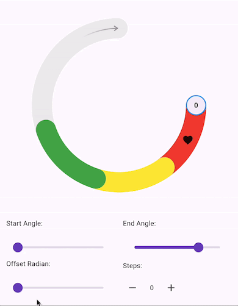
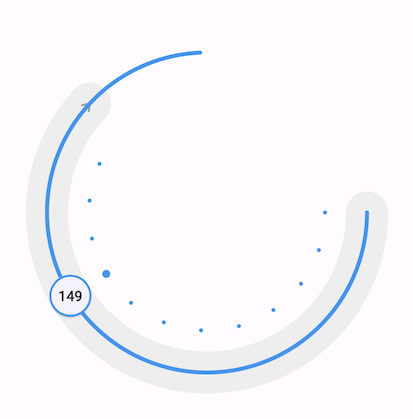
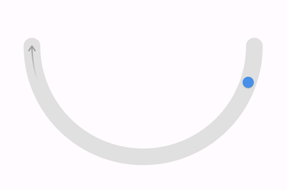

# Circular Slider

 

## Preview



 


## Getting started

- [Installation](#installation)
- [Usage](#usage)

### Installation

Add

```
dependencies:
  circular_slider: ^1.0.0
```

to your `pubspec.yaml`, and run

```bash
flutter packages get
```

in your project's root directory.

### Usage

Here is a basic usage of the widget:

```dart
CircularSlider(
  startAngle: 0.0, // from 0 to 2π, greater than endAngle
  endAngle: 3.141, // from 0 to 2π, less than startAngle
  strokeWidth: 24.0, // width of the track

  // required
  radius: 160,
  value: _value, // a value from 0.0 to 1.0
  knobBuilder: (context, angle) {
    return const Card(
      color: Colors.blue,
      shape: CircleBorder(),
    );
  },
  onChanged: (value) {
    // value obtained will always be between 0.0 and 1.0
    setState(() {
      _value = value;
    });
  },
)
```

The above implementation will look like this:



### Segments, Markers and Notches

CircularSlider also provides these 3 parameter:

| Parameter | DataType |
| ------ | ------ |
| segments | List<CircularSliderSegment\>? |
| markers | List<CircularSliderMarker\>? |
| notchGroups | List<CircularSliderNotchGroup\>? |

These allow you to customize your CircularSlider to be more informative to the user. 

#### CircularSliderSegment

Segments can help you display different value ranges on your Slider.

| Parameter | DataType | Description |
| ------ | ------ | ------ |
| color | Color | Color of the segment |
| start | double | value from 0.0 to 1.0 |
| length | double | length of the segment proportional to the length of the Slider |
| width | double | Width of the segment |

#### CircularSliderMarker

Markers help indicate a position on your Slider. You can use an Icon or any other Widget.  
Use `lockRotation` to make the marker follow the Slider's path.  
This depends on the value of `CircularSlider.steps` parameter if you use `stepIndex`.

| Parameter | DataType | Description |
| ------ | ------ | ------ |
| marker | Widget |  |
| size | Size |  |
| lockRotation | bool | Locks the marker rotation to the center of the Slider circle |
| stepIndex | double? | The index of the Slider step where the marker will be positioned. To use this, value must be null. |
| value | double? | The value where the marker should be positioned. To use this, stepIndex must be null. |

#### CircularSliderNotchGroup

Notches are minimalistic indicators for you Slider. 

This also depends on the value of `CircularSlider.steps` parameter if you use `stepIndex`.

| Parameter | DataType | Description |
| ------ | ------ | ------ |
| notches | List<CircularSliderNotch> | List of [CircularSliderNotch](#circularslidernotch) |
| spacing | double |  |
| stepIndex | double? | The index of the Slider step. To use this, value must be null. |
| value | double? | The value where this group should be positioned. To use this, stepIndex must be null. |

#### CircularSliderNotch

An individual notch in you notch group.

| Parameter | DataType | Description |
| ------ | ------ | ------ |
| radius | double | The radius of the notch circle/dot |
| color | Color | The notch's color |
| filled | bool | Whether the notch dot should be filled or outlined  |
| strokeWidth | double | Width of the outline. |
